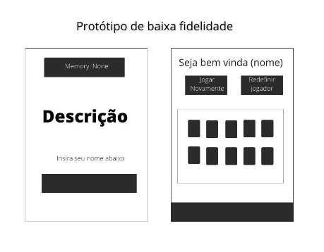
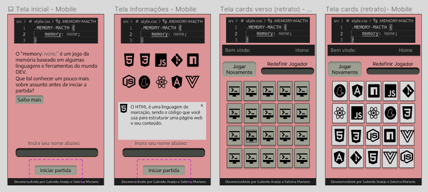
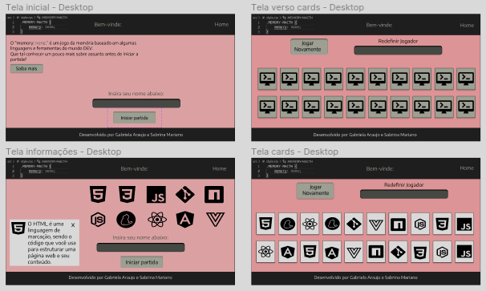
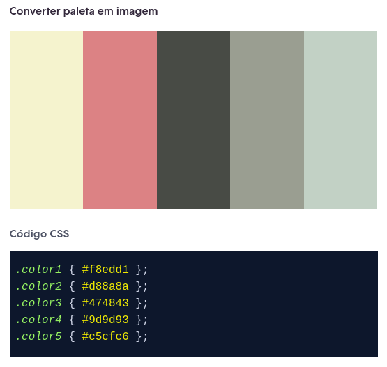

# Memory Match Game

## 1. Preâmbulo

O jogo [_Memory Match_](<https://en.wikipedia.org/wiki/Concentration_(card_game)>),
também conhecido como _Concentration_, _Match Match_, _Match Up_, _Memory_,
entre outros, é um jogo de cartas em que todas as cartas são postas viradas
pra baixo sobre a superficie, virando duas cartas em cada turno. O
objetivo do jogo é encontrar pares de cartas iguais.

## 2. Resumo do projeto

Neste projeto será construído uma versão _web_ do jogo _Memory Match_, em
que uma jogadora possa jogar sozinha no navegador.

O objetivo principal deste projeto é aprender a desenhar e construir uma
interface web baseada em data e interação com a usuária.

O nome do jogo é "Memory:none;" e tema escolhido é o universo Tech/Dev, assim, o jogador poderá ter contato com diversos tipos de linguagens e ferramentas do mundo da programação. O objetivo do jogo é aproximar e divertir tanto profissionais e estudantes do mundo tech como pessoas curiosas sobre a área.

### Histórias de usuário

- **História de usuário 1**
  
  *Eu como jogadora gostaria de ser identificada pelo meu nome, para personalizar a partida.*

- **História de usuário 2**
  
  *Eu como jogadora preciso dos cards dispostos na tela com a função de flip para que tenha a funcionalidade esperada de um jogo da memória.*

- **História de usuário 3**
  
  *Eu como jogadora gostaria de ter um botão jogar novamente, com a função de embaralhar os cards, para que eu possa jogar novamente.*  

## 3. Design do produto
### 3.1 Protótipo de baixa fidelidade

### 3.2 Protótipo alta fidelidade mobile

### 3.3 Protótipo alta fidelidade desktop

### 3.4 Paleta de cores

## 4. Testes unitários

## 5. Objetivos de aprendizagem

Na construção desse projeto a equipe trabalhou com as seguintes linguagens e ferramentas:

### HTML
-  **Uso de HTML semântico**

### CSS
- **Uso de seletores de CSS**
-  **Modelo de caixa (box model): borda, margem, preenchimento**
- **Uso de flexbox em CSS**

### Web APIs
- **Uso de seletores de DOM**
- **Manipulação de eventos de DOM**
- **Manipulação dinâmica de DOM**

### JavaScript

- **Diferenciar entre tipos de dados primitivos e não primitivos**
- **Manipular arrays (filter, map, sort, reduce)**
- **Manipular objects (key | value)**
- **Variáveis (declaração, atribuição, escopo)**
- **Uso de condicionais (if-else, switch, operador ternário)**
- **Uso de laços (for, for..of, while)**
- **Uso de funções (parâmetros, argumentos, valor de retorno)**
- **Testes unitários**
- **Módulos de ECMAScript (ES modules)**
- **Uso de linter (ESLINT)**
- **Uso de identificadores descritivos (Nomenclatura | Semântica)**
- **Diferença entre expression e statements**
- **Método de SPA**

### Controle de Versões (Git e GitHub)

- **Git: Instalação e configuração**
- **Git: Controle de versão com git (init, clone, add, commit, status, push, pull, remote)**
- **Git: Integração de mudanças entre ramos (branch, checkout, fetch, merge, reset, rebase, tag)**
- **GitHub: Criação de contas e repositórios, configuração de chave SSH**
- **GitHub: Implantação com GitHub Pages**
- **GitHub: Colaboração pelo Github (branches | forks | pull requests | code review | tags)**
  
### User-centricity
- **Desenhar a aplicação pensando e entendendo a usuária**

### Product-design

- **Criar protótipos para obter feedback e iterar**

- **Aplicar os princípios de desenho visual (contraste, alinhamento, hierarquia)**

### Research

- **Planejar e executar testes de usabilidade**

